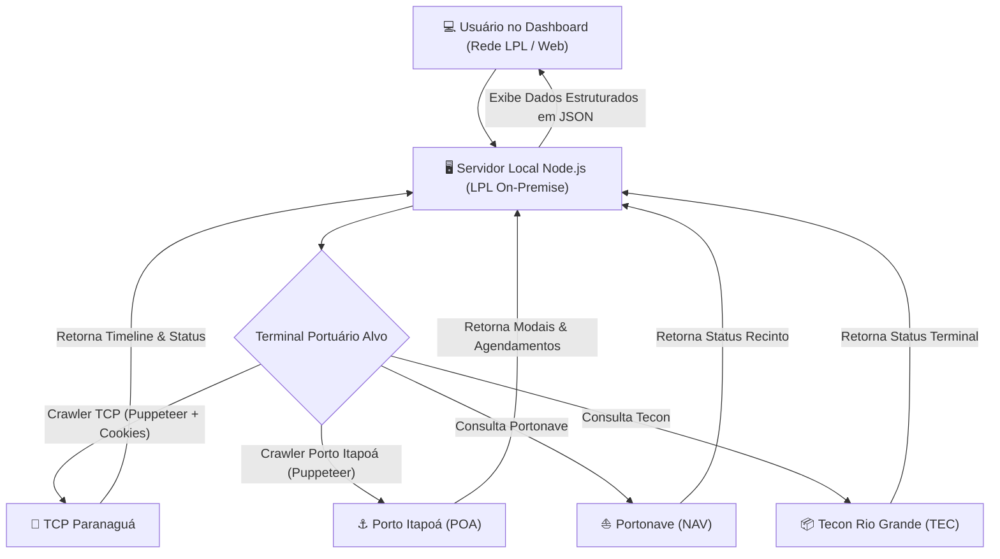

# 📚 Manual de Arquitetura e Especificação Técnica: Rastreamento de Portos (LPL)

> **Projeto de Origem**: LPL Comissária  
> **Projeto de Destino**: LPL - Relatórios - Dashboard (Servidor Interno On-Premise LPL)  
> **Data**: Agosto de 2026  

---

## 🌐 1. Visão Geral da Arquitetura para o Servidor Interno (On-Premise)

Ao executar o projeto diretamente no **Servidor Local / On-Premise da LPL**, a arquitetura se simplifica drasticamente em relação aos ambientes de nuvem pública (Render/Vercel):

### 💡 Por que no Servidor Interno NÃO precisa de `ngrok`?
- **IP Comercial Limpo**: Como o servidor interno está conectado diretamente à rede corporativa/comercial da LPL, todas as requisições de saída (HTTP e navegadores headless via Puppeteer) partem do IP comercial fixo da empresa.
- **Bypass de WAF / Cloudflare**: Os portais portuários (TCP, Portonave, Itapoá e Tecon) bloqueiam apenas IPs conhecidos de datacenters em nuvem (AWS, GCP, Render). As requisições vindas do IP comercial do escritório são tratadas como acessos normais de usuário.
- **Sem Limites de Timeout**: O Puppeteer roda sem o limite de 10-15s imposto por funções Serverless em nuvem.



---

## 🚢 2. Terminal 1: TCP (Terminal de Contêineres de Paranaguá)

### A. Fluxo de Autenticação e Cookies
- **Portal**: `https://meuportal.tcp.com.br`
- **Gestão de Sessão**:
  - Utiliza o arquivo `tcp-cookies.json` armazenado no servidor.
  - **Cookies Chave**: `sid`, `JSESSIONID`, `ASP.NET_SessionId`, `.ASPXAUTH`, `apex__*`.
  - **Bookmarklet de 1-Clique**: Injeta um script Javascript nos favoritos do navegador do operador. Quando logado no portal TCP, 1 clique envia os cookies atualizados via `POST /api/cookies/sync`.

### B. Extração de Dados (Puppeteer)
```javascript
// Configuração do Puppeteer para Evasão de WAF
const launchOptions = {
  headless: true,
  args: [
    '--no-sandbox',
    '--disable-setuid-sandbox',
    '--disable-web-security'
  ]
};

// Injeção no Page do Puppeteer
await page.evaluateOnNewDocument(() => {
  Object.defineProperty(navigator, 'webdriver', { get: () => undefined });
  window.chrome = { app: { isInstalled: false } };
});
```

### C. Estrutura do JSON de Retorno (TCP)
```json
{
  "api": "TCP",
  "container": "CRLU1339221",
  "status": "Importação Liberada",
  "weight": "22.400 kg",
  "type": "40HC",
  "vessel": "MSC VALERIA / 241A",
  "booking": "BKG-TCP-98765",
  "location": "Pátio Principal - Quadra B2",
  "timeScraped": "11:05:00",
  "history": [
    { "event": "Gate In (Entrada no terminal)", "date": "2026-06-24 08:30" },
    { "event": "Liberação Receita Federal", "date": "2026-06-24 14:15" },
    { "event": "Pronto para Retirada", "date": "2026-06-25 09:00" }
  ]
}
```

---

## ⚓ 3. Terminal 2: Porto Itapoá (POA)

### A. Fluxo de Rastreamento e Regex de Agendamento
- **Portal**: `https://portos.portoitapoa.com.br`
- **Cookies**: `poa-cookies.json`
- **Etapas do Scraper**:
  1. Acessa a tela de Rastreamento de Agendamentos/Contêineres.
  2. Preenche a busca por Booking ou Contêiner e aciona o botão de pesquisa (`.flaticon2-search`).
  3. Clica no ícone de "Detalhes do Agendamento".
  4. Aplica Expressões Regulares (Regex) no HTML/Texto da modal para capturar as janelas de tempo:
     - **Data de Entrada/Depósito**: `/Dep[óo]sito\s*:\s*([\d\/\s:]+)/i`
     - **Fim da Janela**: `/Fim\s*da\s*Janela\s*:\s*([\d\/\s:]+)/i`

### B. Estrutura do JSON de Retorno (POA)
```json
{
  "api": "POA",
  "container": "CRLU1339221",
  "booking": "334290",
  "status": "Agendado - Entrada Liberada",
  "vessel": "B.BULK MINERVA",
  "dataEntrada": "2026-07-20 14:00",
  "fimJanela": "2026-07-22 18:00",
  "timeScraped": "11:05:00",
  "history": [
    { "event": "Reserva de Janela Efetuada", "date": "2026-07-18 10:00" },
    { "event": "Gate In Confirmado", "date": "2026-07-20 14:15" }
  ]
}
```

---

## ⛵ 4. Terminal 3: Portonave (NAV - Navegantes)

### A. Fluxo de Consulta
- **Portal**: `https://www.portonave.com.br`
- **Cookies**: `nav-cookies.json`
- **Campos Extraídos**:
  - Navio / Viagem.
  - Status de Presença de Carga no Recinto Alfandegado.
  - Pátio e datas de Gate In / Gate Out.

### B. Estrutura do JSON de Retorno (NAV)
```json
{
  "api": "NAV",
  "container": "CRLU1339221",
  "status": "No Pátio - Presença de Carga Confirmada",
  "vessel": "CAP SAN ARTEMISIO",
  "gateIn": "2026-07-15 09:30",
  "timeScraped": "11:05:00",
  "history": [
    { "event": "Presença de Carga Registrada", "date": "2026-07-15 10:00" }
  ]
}
```

---

## 📦 5. Terminal 4: Tecon Rio Grande (TEC)

### A. Fluxo de Consulta
- **Portal**: `https://www.tecon.com.br`
- **Cookies**: `tec-cookies.json`
- **Campos Extraídos**: Status do Terminal, Liberação SIF/RFB, Posicionamento.

### B. Estrutura do JSON de Retorno (TEC)
```json
{
  "api": "TEC",
  "container": "CRLU1339221",
  "status": "Aguardando Embarque",
  "vessel": "LOGIN PANTANAL",
  "timeScraped": "11:05:00",
  "history": [
    { "event": "Entrada no Terminal", "date": "2026-07-12 16:20" }
  ]
}
```

---

## 📊 6. Regra de Consolidação de Status para o Dashboard Frontend

Para calcular o status consolidado de cada processo na tabela do novo **Dashboard de Relatórios**:

```javascript
function calculateAggregatedStatus(statuses) {
  const getWeight = (s) => {
    if (!s) return 0;
    if (s.status === 'erro login') return 4; // Prioridade Máxima (Alerta vermelho no painel)
    if (s.status === 'erro api') return 3;   // Erro de conexão
    if (s.status === 'success' && s.message === 'Sucesso') return 2; // Pílula Verde
    if (s.status === 'success' && s.message === 'Não encontrado') return 1; // Pílula Cinza
    return 0;
  };

  let topStatus = { status: 'none', message: 'Não consultado' };
  Object.keys(statuses).forEach(port => {
    if (getWeight(statuses[port]) > getWeight(topStatus)) {
      topStatus = statuses[port];
    }
  });
  return topStatus;
}
```

---

## 📝 7. Checklist de Migração para o Servidor Local da LPL

1. **Variáveis de Ambiente (`.env`)**:
   - `PORT=3000` (ou porta desejada no servidor interno).
   - Configurações de Banco de Dados Postgres Local / Supabase.
2. **Dependência Puppeteer**:
   - `npm install puppeteer` (instala o Chromium integrado para o Puppeteer rodar sem precisar de navegador externo).
3. **Persistência de Cookies**:
   - Manter a pasta do projeto com permissão de escrita para salvamento automático de `tcp-cookies.json`, `poa-cookies.json`, `nav-cookies.json` e `tec-cookies.json`.
