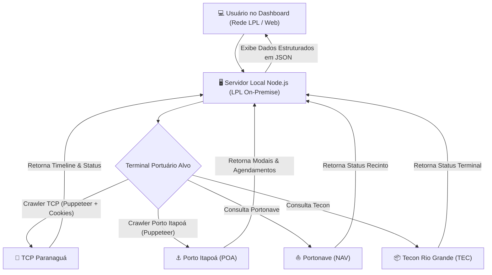
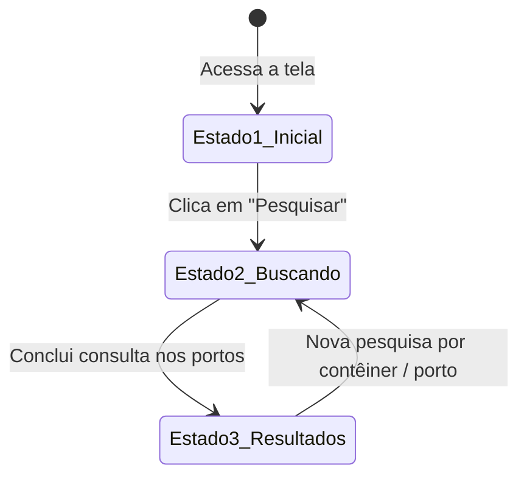

# 📚 Manual de Arquitetura e Especificação Técnica: Rastreamento de Portos (LPL)

> **Projeto de Origem**: LPL Comissária  
> **Projeto de Destino**: LPL - Relatórios - Dashboard (Servidor Interno On-Premise LPL)  
> **Data**: Agosto de 2026  

---

## 🌐 1. Visão Geral da Arquitetura para o Servidor Interno (On-Premise)

Ao executar o projeto diretamente no **Servidor Local / On-Premise da LPL**, a arquitetura se simplifica drasticamente em relação aos ambientes de nuvem pública (Render/Vercel):

### 💡 Por que no Servidor Interno NÃO precisa de `ngrok`?
- **IP Comercial Limpo**: Como o servidor interno está conectado diretamente à rede corporativa/comercial da LPL, todas as requisições de saída (HTTP e navegadores headless via Puppeteer) partem do IP comercial fixo da empresa.
- **Bypass de WAF / Cloudflare**: Os portais portuários (TCP, Portonave, Itapoá e Tecon) bloqueiam apenas IPs conhecidos de datacenters em nuvem (AWS, GCP, Render). As requisições vindas do IP comercial do escritório são tratadas como acessos normais de usuário.
- **Sem Limites de Timeout**: O Puppeteer roda sem o limite de 10-15s imposto por funções Serverless em nuvem.



---

## 🎨 2. Especificação da Interface do Usuário (UI/UX) - Ordem de Telas e Transições Visuais

A interface de busca de contêineres possui **3 Estados de Visualização Dinâmicos** que se alteram de acordo com o fluxo da pesquisa:



### 🖼️ Estado 1: Tela Inicial & Status de Conexão dos Portos
- **Cabeçalho Principal**: Título `LPL Planilha & Rastreamento` com botões superiores `🌐 Abrir Portal TCP` e `🔗 Sincronizador 1 Clique`.
- **Formulário de Busca**:
  - `Código do Contêiner` (Input text aceitando busca única ou em lote separada por vírgulas, ex: `MNBU0521466, MMAU1171363`).
  - `Booking / Reserva (Itapoá)` (Input text opcional).
  - Botão azul `Pesquisar`.
- **Grid de Saúde dos Terminais (4 Cards)**:
  - `TCP (Paranaguá)`: Exibe pílula verde `Conectado (28/08 às 14:50)` se os cookies estão válidos, ou vermelha `Desconectado (Sem cookies)`.
  - `POA (Itapoá)` / `NAV (Portonave)` / `TEC (Teconline)`: Cards interativos que permitem clicar para consultar um porto específico.

---

### ⏳ Estado 2: Tela "Buscando nos terminais portuários..."
- **Alteração nos Cards Superiores**:
  - Os cards dos terminais entram no estado `searching` (borda azul pulsante com animação CSS `@keyframes pulse-active`).
  - As pílulas de status exibem o texto `Buscando...`.
- **Área Central de Progresso**:
  - Exibe a mensagem em destaque: **`Buscando nos terminais portuários...`** acompanhada por um spinner animado.
  - Renderiza uma lista vertical de cartões de progresso para cada contêiner informado no lote.
  - **Evolução em Tempo Real**:
    - Enquanto pesquisa: Pílula azul com spinner `MNBU0521466 | Buscando...`
    - Ao encontrar: Altera para borda verde com ícone `✔ Achado em TCP (Bkg: 334290)`
    - Se não encontrar: Altera para borda vermelha com ícone `✖ Não encontrado`

---

### 📊 Estado 3: Tela de Resultados da Busca (Card Rastreamento Completo)
Após a conclusão da pesquisa, a área central exibe o contador `Resultados da busca (N):` e renderiza os cartões detalhados de cada contêiner:

#### 1. Cabeçalho do Cartão
- Badge colorido do porto (`[ TCP ]` azul, `[ POA ]` verde, `[ NAV ]` roxo, `[ TEC ]` laranja).
- Número do Contêiner em destaque (`MNBU0521466`).
- Horário da consulta (`12:47:54`).

#### 2. Barra de Progresso (Stepper de 4 Etapas Visual)
Uma linha do tempo horizontal mostrando o avanço físico/operacional da carga:
- **Etapa 1**: `Entrada` (Data de Gate In)
- **Etapa 2**: `Aduaneiro` (Data de liberação RFB/SIF)
- **Etapa 3**: `Embarque` (Data de embarque no navio)
- **Etapa 4**: `Faturamento` (Data de faturamento/saída)
- *Estilização*: Círculos verdes com check `✓` para etapas concluídas, círculos azuis para a etapa atual ativa, e cinzas para pendentes, interligados por linhas de progresso coloridas.

#### 3. Menu de Sub-abas (`Situação` | `Detalhes` | `Agendamento`)
- **Aba `Situação` (Ativa por padrão)**:
  Grid responsivo com quadros de 2 linhas (Título em cinza + Valor em negrito):
  - `Número:` `MNBU0521466`
  - `Data de Cadastro:` `23/06/2026 10:14`
  - `Data de Entrada:` `25/06/2026 15:06`
  - `Data de Embarque:` `-`
  - `Data de Saída:` `-`
  - `Dias no Porto:` `1`
  - `Liberado Ordem de Embarque:` `Sim`
  - `Porto Descarga:` `Ningbo`
  - `Retenções:` `Ver`
  - `Navio | Serviço:` `CAP SAN ARTEMISSIO | AS2`
  - `Histórico de Cobrança:` `Ver`
  - `LAR:` `-`
  - `Status:` `Dentro do Terminal`
  - `Recepção CCT:` `25/06/2026 15:41`
  - `Entrega CCT:` `-`
  - `Modalidade:` `LONGO_CURSO`

- **Aba `Detalhes`**:
  Exibe os pares chave-valor de pesagem, tara, payload, e a tabela de documentos vinculados (DI, DUE, CE, Termo de Fiel Depositário).

- **Aba `Agendamento`**:
  Exibe a timeline específica do portão do terminal (Agendamento, SAV, Entrada Gate, Operação, Saída Gate).

---

## 🛠️ 3. Código Frontend de Referência (HTML/JS/CSS)

### CSS da Animação do Estado "Buscando":
```css
@keyframes pulse-active {
  0% { box-shadow: 0 0 0 0 rgba(10, 132, 255, 0.4); }
  70% { box-shadow: 0 0 0 8px rgba(10, 132, 255, 0); }
  100% { box-shadow: 0 0 0 0 rgba(10, 132, 255, 0); }
}

.spinner-inline {
  display: inline-block;
  width: 18px;
  height: 18px;
  border: 2px solid rgba(255,255,255,0.3);
  border-radius: 50%;
  border-top-color: #0a84ff;
  animation: spin 0.8s linear infinite;
}

@keyframes spin {
  to { transform: rotate(360deg); }
}
```

### Função de Troca de Sub-abas (`switchSubTab`):
```javascript
function switchSubTab(btn, tabName, containerId) {
  const container = btn.closest('.sub-tabs-container');
  if (!container) return;

  // Atualizar botões
  container.querySelectorAll('.sub-tab-btn').forEach(b => {
    b.classList.remove('active');
    b.style.color = 'var(--muted)';
    b.style.borderBottomColor = 'transparent';
  });

  btn.classList.add('active');
  btn.style.color = 'var(--text)';
  btn.style.borderBottomColor = '#bc9855';

  // Atualizar conteúdos
  container.querySelectorAll('.sub-tab-content').forEach(c => c.style.display = 'none');
  const targetContent = document.getElementById(`content-${tabName}-${containerId}`);
  if (targetContent) targetContent.style.display = 'block';
}
```

---

## 🚢 4. Terminal 1: TCP (Terminal de Contêineres de Paranaguá)

### A. Fluxo de Autenticação e Cookies
- **Portal**: `https://meuportal.tcp.com.br`
- **Gestão de Sessão**:
  - Utiliza o arquivo `tcp-cookies.json` armazenado no servidor.
  - **Cookies Chave**: `sid`, `JSESSIONID`, `ASP.NET_SessionId`, `.ASPXAUTH`, `apex__*`.
  - **Bookmarklet de 1-Clique**: Injeta um script Javascript nos favoritos do navegador do operador. Quando logado no portal TCP, 1 clique envia os cookies atualizados via `POST /api/cookies/sync`.

### B. Extração de Dados (Puppeteer)
```javascript
// Configuração do Puppeteer para Evasão de WAF
const launchOptions = {
  headless: true,
  args: [
    '--no-sandbox',
    '--disable-setuid-sandbox',
    '--disable-web-security'
  ]
};

// Injeção no Page do Puppeteer
await page.evaluateOnNewDocument(() => {
  Object.defineProperty(navigator, 'webdriver', { get: () => undefined });
  window.chrome = { app: { isInstalled: false } };
});
```

### C. Estrutura do JSON de Retorno (TCP)
```json
{
  "api": "TCP",
  "container": "MNBU0521466",
  "status": "Dentro do Terminal",
  "isDetailed": true,
  "stepper": {
    "Entrada": { "date": "25/06/2026 15:06", "state": "completed" },
    "Aduaneiro": { "date": "25/06/2026 15:41", "state": "completed" },
    "Embarque": { "date": "-", "state": "pending" },
    "Faturamento": { "date": "-", "state": "pending" }
  },
  "situacao": {
    "Número": "MNBU0521466",
    "Data de Cadastro": "23/06/2026 10:14",
    "Data de Entrada": "25/06/2026 15:06",
    "Data de Embarque": "-",
    "Data de Saída": "-",
    "Dias no Porto": "1",
    "Liberado Ordem de Embarque": "Sim",
    "Porto Descarga": "Ningbo",
    "Retenções": "Ver",
    "Navio | Serviço": "CAP SAN ARTEMISSIO | AS2",
    "Histórico de Cobrança": "Ver",
    "LAR": "-",
    "Status": "Dentro do Terminal",
    "Recepção CCT": "25/06/2026 15:41",
    "Entrega CCT": "-",
    "Modalidade": "LONGO_CURSO"
  },
  "detalhes": {
    "kvs": {
      "Peso Bruto": "28.500 kg",
      "Tipo": "40HC"
    },
    "documentos": []
  },
  "agendamento": {
    "kvs": {},
    "timeline": {
      "Agendamento": "24/06/2026 10:00",
      "SAV": "25/06/2026 14:00",
      "Entrada Gate": "25/06/2026 15:06",
      "Operação": "Em Processo",
      "Saída Gate": "-"
    }
  },
  "timeScraped": "12:47:54"
}
```

---

## ⚓ 5. Terminal 2: Porto Itapoá (POA)

### A. Fluxo de Rastreamento e Regex de Agendamento
- **Portal**: `https://portos.portoitapoa.com.br`
- **Cookies**: `poa-cookies.json`
- **Etapas do Scraper**:
  1. Acessa a tela de Rastreamento de Agendamentos/Contêineres.
  2. Preenche a busca por Booking ou Contêiner e aciona o botão de pesquisa (`.flaticon2-search`).
  3. Clica no ícone de "Detalhes do Agendamento".
  4. Aplica Expressões Regulares (Regex) no HTML/Texto da modal para capturar as janelas de tempo:
     - **Data de Entrada/Depósito**: `/Dep[óo]sito\s*:\s*([\d\/\s:]+)/i`
     - **Fim da Janela**: `/Fim\s*da\s*Janela\s*:\s*([\d\/\s:]+)/i`

### B. Estrutura do JSON de Retorno (POA)
```json
{
  "api": "POA",
  "container": "CRLU1339221",
  "booking": "334290",
  "status": "Agendado - Entrada Liberada",
  "vessel": "B.BULK MINERVA",
  "dataEntrada": "2026-07-20 14:00",
  "fimJanela": "2026-07-22 18:00",
  "timeScraped": "11:05:00",
  "history": [
    { "event": "Reserva de Janela Efetuada", "date": "2026-07-18 10:00" },
    { "event": "Gate In Confirmado", "date": "2026-07-20 14:15" }
  ]
}
```

---

## ⛵ 6. Terminal 3: Portonave (NAV - Navegantes)

### A. Fluxo de Consulta
- **Portal**: `https://www.portonave.com.br`
- **Cookies**: `nav-cookies.json`
- **Campos Extraídos**: Navio/Viagem, Status de Presença de Carga, Pátio, Datas de Gate In / Gate Out.

### B. Estrutura do JSON de Retorno (NAV)
```json
{
  "api": "NAV",
  "container": "CRLU1339221",
  "status": "No Pátio - Presença de Carga Confirmada",
  "vessel": "CAP SAN ARTEMISIO",
  "gateIn": "2026-07-15 09:30",
  "timeScraped": "11:05:00",
  "history": [
    { "event": "Presença de Carga Registrada", "date": "2026-07-15 10:00" }
  ]
}
```

---

## 📦 7. Terminal 4: Tecon Rio Grande (TEC)

### A. Fluxo de Consulta
- **Portal**: `https://www.tecon.com.br`
- **Cookies**: `tec-cookies.json`
- **Campos Extraídos**: Status do Terminal, Liberação SIF/RFB, Posicionamento.

### B. Estrutura do JSON de Retorno (TEC)
```json
{
  "api": "TEC",
  "container": "CRLU1339221",
  "status": "Aguardando Embarque",
  "vessel": "LOGIN PANTANAL",
  "timeScraped": "11:05:00",
  "history": [
    { "event": "Entrada no Terminal", "date": "2026-07-12 16:20" }
  ]
}
```

---

## 📊 8. Regra de Consolidação de Status para o Dashboard Frontend

Para calcular o status consolidado de cada processo na tabela do novo **Dashboard de Relatórios**:

```javascript
function calculateAggregatedStatus(statuses) {
  const getWeight = (s) => {
    if (!s) return 0;
    if (s.status === 'erro login') return 4; // Prioridade Máxima (Alerta vermelho no painel)
    if (s.status === 'erro api') return 3;   // Erro de conexão
    if (s.status === 'success' && s.message === 'Sucesso') return 2; // Pílula Verde
    if (s.status === 'success' && s.message === 'Não encontrado') return 1; // Pílula Cinza
    return 0;
  };

  let topStatus = { status: 'none', message: 'Não consultado' };
  Object.keys(statuses).forEach(port => {
    if (getWeight(statuses[port]) > getWeight(topStatus)) {
      topStatus = statuses[port];
    }
  });
  return topStatus;
}
```

---

## 📝 9. Checklist de Migração para o Servidor Local da LPL

1. **Variáveis de Ambiente (`.env`)**:
   - `PORT=3000` (ou porta desejada no servidor interno).
   - Configurações de Banco de Dados Postgres Local / Supabase.
2. **Dependência Puppeteer**:
   - `npm install puppeteer` (instala o Chromium integrado para o Puppeteer rodar sem precisar de navegador externo).
3. **Persistência de Cookies**:
   - Manter a pasta do projeto com permissão de escrita para salvamento automático de `tcp-cookies.json`, `poa-cookies.json`, `nav-cookies.json` e `tec-cookies.json`.
